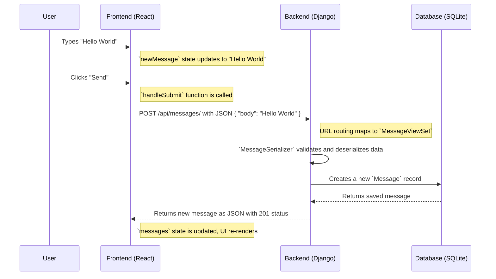

# Data Flow: Sending a Message

This document explains the flow of data when a user types a message in the text box and clicks "Send".

## Diagram

## Step-by-Step Breakdown

### Frontend (React)

1.  **User Input:** You type your message into the input field.
    *   **File:** [`frontend/src/App.js`](frontend/src/App.js:1)
    *   **Variable:** The `newMessage` state variable is updated with every character you type.

2.  **Form Submission:** You click the "Send" button.
    *   **File:** [`frontend/src/App.js`](frontend/src/App.js:1)
    *   **Function:** The `handleSubmit` function is triggered. This function prevents the default form submission behavior.

3.  **API Request:** A `POST` request is sent to the backend API endpoint.
    *   **File:** [`frontend/src/App.js`](frontend/src/App.js:1)
    *   **URL:** `http://localhost:8000/api/messages/`
    *   **Data Sent:** A JSON object containing the message: `{ "body": "your message" }`

4.  **UI Update:** After the backend confirms the message has been created, the response (the new message object) is used to update the UI.
    *   **File:** [`frontend/src/App.js`](frontend/src/App.js:1)
    *   **Variable:** The `messages` state array is updated with the new message. This triggers React to re-render the component, displaying the new message on the screen. The `newMessage` state is then cleared.

### Backend (Django)

1.  **URL Routing:** The incoming `POST` request is routed to the correct view.
    *   **File:** [`backend/backend/urls.py`](backend/backend/urls.py:1) -> Forwards requests from `/api/` to the `api` app.
    *   **File:** [`backend/api/urls.py`](backend/api/urls.py:1) -> Maps the request to the `MessageViewSet`.

2.  **View Processing:** The `MessageViewSet` handles the creation of a new message.
    *   **File:** [`backend/api/views.py`](backend/api/views.py:1)
    *   **Action:** The `create` method is executed. This method is not explicitly defined in `MessageViewSet` but is inherited from `rest_framework.viewsets.ModelViewSet`, which provides default implementations for creating, reading, updating, and deleting model instances.

3.  **Serialization & Validation:** The incoming JSON data is converted into a `Message` model instance.
    *   **File:** [`backend/api/serializers.py`](backend/api/serializers.py:1)
    *   **Class:** `MessageSerializer` validates that the data is in the correct format and creates a `Message` object.

4.  **Database Interaction:** The new `Message` object is saved to the database.
    *   **File:** [`backend/api/models.py`](backend/api/models.py:1)
    *   **Action:** A new row with your message is inserted into the `api_message` table in the `db.sqlite3` database file.

5.  **API Response:** The backend sends a response back to the frontend.
    *   **File:** [`backend/api/views.py`](backend/api/views.py:1)
    *   **Data Sent:** A JSON representation of the newly created message object with a `201 Created` HTTP status.